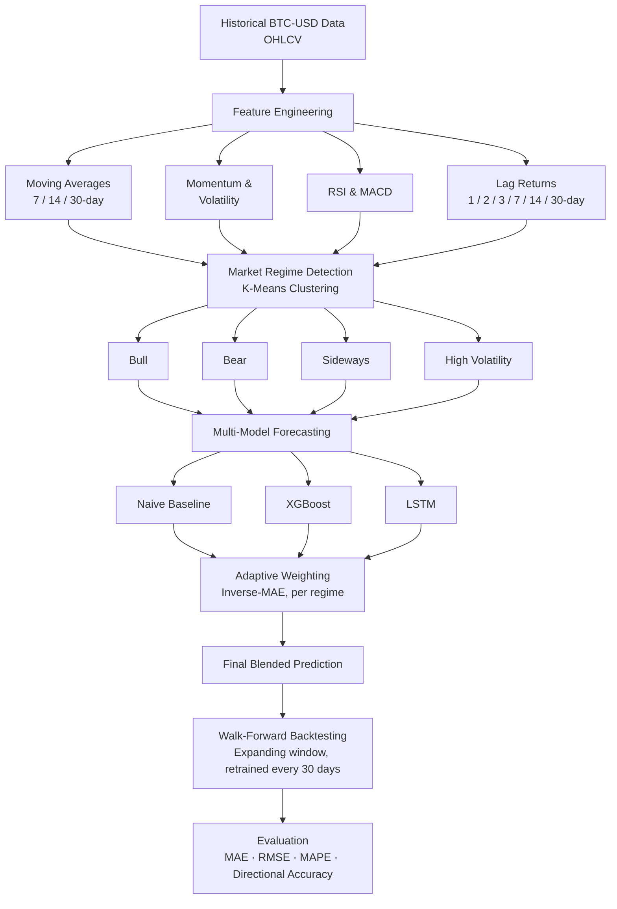

# BTC-Adapt

**An Adaptive Regime-Aware Multi-Model Framework for Bitcoin Price Forecasting**

BTC-Adapt investigates whether Bitcoin price forecasting can be made more robust by first detecting the current market condition — bull, bear, sideways, or high-volatility — and then dynamically weighting predictions from multiple models based on which has performed best under that specific condition, rather than relying on a single fixed model for everything.

---

## The problem

Most Bitcoin forecasting projects use one model regardless of market conditions:

```
Bitcoin data → LSTM → Prediction
```

But Bitcoin doesn't behave the same way all the time. A model tuned for calm, trending markets often performs poorly during a crash or a sudden volatility spike. BTC-Adapt asks a different question:

> **Can we first understand what kind of market Bitcoin is currently in, and then use the model best suited to that situation?**

## Research question

> Does adapting the forecasting strategy to the current market regime improve prediction robustness, compared to conventional single-model approaches?

**H₀ (null):** Adaptive regime-aware forecasting does not significantly improve forecasting performance compared with conventional single-model approaches.

**H₁ (alternative):** Adaptive regime-aware forecasting improves forecasting robustness compared with conventional single-model approaches, particularly when Bitcoin transitions between different market regimes.

This is a hypothesis being tested, not a claim being made in advance.

---

## System architecture



---

## What's in this repo

This repo contains the **dashboard** — a frontend visualizing results produced by a separate Python ML pipeline. The dashboard reads pre-computed results from `public/btc_adapt_results.json`; it does not train models itself.

The ML pipeline (run separately in Google Colab) fetches real BTC-USD data, engineers technical features, runs K-Means for regime detection, trains real XGBoost and LSTM models, walk-forward backtests them, and exports results in the JSON schema below.

### Dashboard features

| Feature | Description |
|---|---|
| **Regime detection display** | Current market condition, with a plain-language explanation |
| **Tomorrow's prediction** | Next-day forecast with an honest confidence range, not a false-precision single number |
| **Model weight breakdown** | How much each model (Naive / XGBoost / LSTM) contributes under the current regime |
| **Actual vs. predicted chart** | Full backtest history plus a clearly marked forecast point |
| **Feature importance panel** | What's actually driving each prediction (XGBoost gain-based importance) |
| **Metrics comparison** | MAE, RMSE, MAPE, and Directional Accuracy across all four approaches |
| **Methodology & limitations panel** | A transparent account of what this project does and does not claim |

---

## Tech stack

**Frontend (this repo)**
- React + TypeScript
- Tailwind CSS
- Recharts

**ML pipeline** (`btc_adapt_pipeline.py`, run in Google Colab)
- Python
- pandas, numpy
- scikit-learn (K-Means, StandardScaler)
- XGBoost
- TensorFlow / Keras (LSTM)
- yfinance (data source)

---

## Data schema

The dashboard expects `public/btc_adapt_results.json` in this shape:

```json
{
  "prices": [{ "date": "YYYY-MM-DD", "close": 0 }],
  "regimes": [{ "date": "YYYY-MM-DD", "regime": "Bull" }],
  "predictions": [{ "date": "YYYY-MM-DD", "actual": 0, "predicted": 0 }],
  "weights_by_regime": {
    "Bull": { "naive": 0, "xgboost": 0, "lstm": 0 },
    "Bear": { "naive": 0, "xgboost": 0, "lstm": 0 },
    "Sideways": { "naive": 0, "xgboost": 0, "lstm": 0 },
    "High Volatility": { "naive": 0, "xgboost": 0, "lstm": 0 }
  },
  "metrics": {
    "naive": { "mae": 0, "rmse": 0, "mape": 0, "directional_accuracy": 0 },
    "xgboost": { "mae": 0, "rmse": 0, "mape": 0, "directional_accuracy": 0 },
    "lstm": { "mae": 0, "rmse": 0, "mape": 0, "directional_accuracy": 0 },
    "btc_adapt": { "mae": 0, "rmse": 0, "mape": 0, "directional_accuracy": 0 }
  },
  "current_regime": "High Volatility",
  "current_price": 0,
  "predicted_next_price": 0,
  "predicted_next_return": 0,
  "predicted_next_price_low": 0,
  "predicted_next_price_high": 0,
  "confidence_band": { "residual_std": 0, "window_days": 30, "note": "..." },
  "feature_importance": [{ "feature": "volatility_30", "importance": 0, "importance_pct": 0 }],
  "rolling_accuracy": [{ "period_start": "YYYY-MM-DD", "period_end": "YYYY-MM-DD", "directional_accuracy": 0, "mae": 0 }],
  "backtest_info": {
    "total_backtested_days": 0,
    "walk_forward_folds": 0,
    "retrain_frequency_days": 30,
    "regime_detection_method": "K-Means (4 clusters) on volatility, momentum, and trend features",
    "limitations": ["..."]
  }
}
```

---

## Honest limitations

- Backtest window covers a limited historical period and may not include extreme black-swan events
- No transaction costs, slippage, or exchange fees are modeled
- The confidence range shown is based on recent prediction error spread, not a formal statistical model
- Feature importance reflects only the most recently trained model fold, not an average across all walk-forward folds
- This is a research demonstration, not financial advice — past backtested performance does not guarantee future results

---

## Running the dashboard locally

```bash
git clone https://github.com/shreya2707-glitch/BTC-Adapt.git
cd BTC-Adapt
npm i
npm run dev
```

## Regenerating the data

Run `btc_adapt_pipeline.py` in Google Colab (installs its own dependencies, fetches live BTC-USD data, trains models, and exports results). Replace `public/btc_adapt_results.json` with the new output to update the dashboard.

---

Built by Shreya and Jenice· frontend scaffolded with [Lovable](https://lovable.dev) for Glimpse Trading Hackathon 
